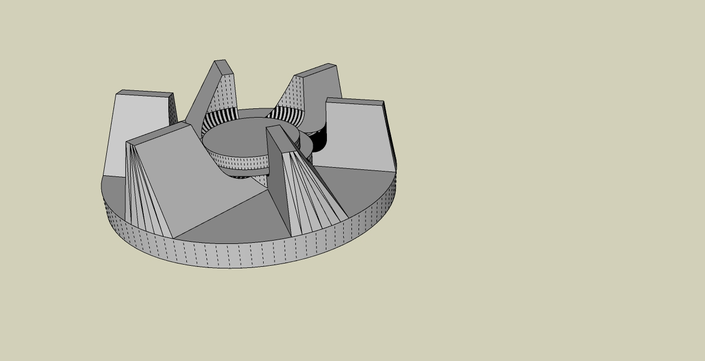
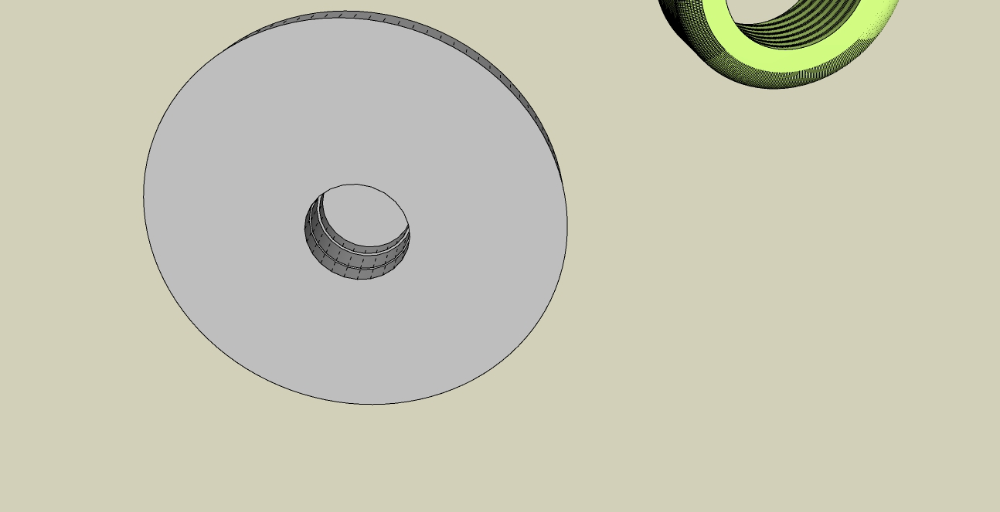
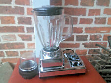
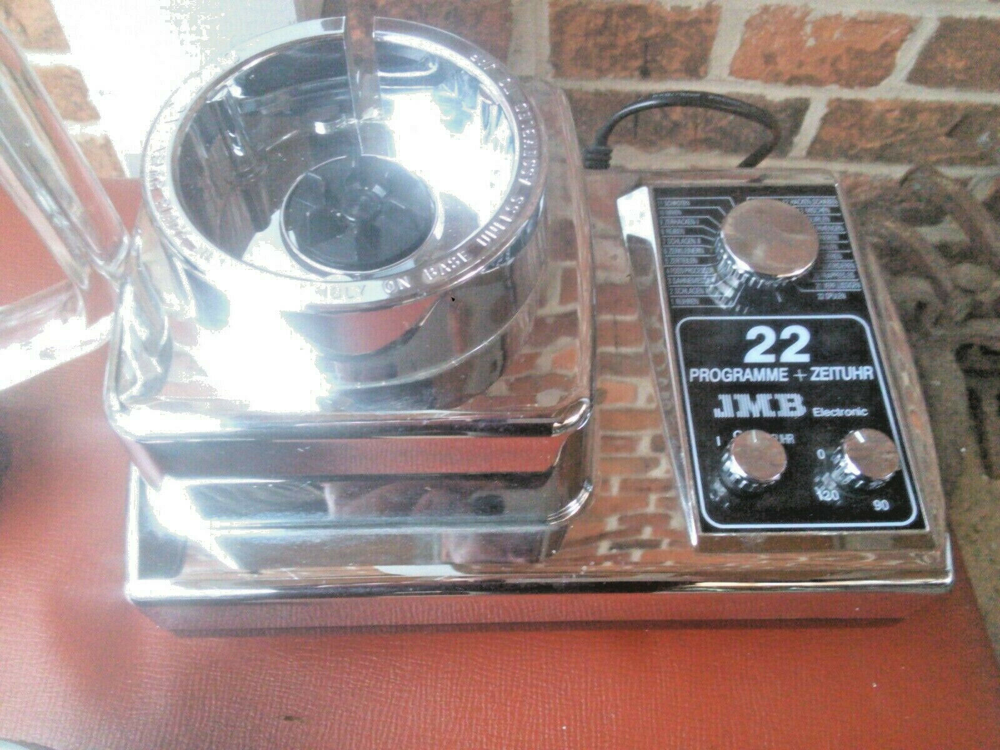

# JMB_22_Mixer_Ersatzteil

Kupplung für einen Mixer der **Marke JMB** **Modell 22**. Erstellt mit SketchUp im [erfindergarden München](http://www.erfindergarden.de).

Ich habe das Design für zwei Befestigungsmethoden konstruiert. Zum einen ist es möglich die original Einschlaghülse mit einem M6 Gewinde **(Achtung! Linksgewinde)** oder man nimmt das zweite Design für eine Mutter M6 Gewinde. Die Einschlaghülse muss mit dem Heißluftfön erhizt werden und dann vorsichtig eingeschoben werden. Das ist etwas kniffelig.

Die M6-Mutter-Version ist einfacher zu handhaben, da die Mutter nur eingeklebt werden muss. 

Die Mutter gibt es bei ebay für 1 Euro.

